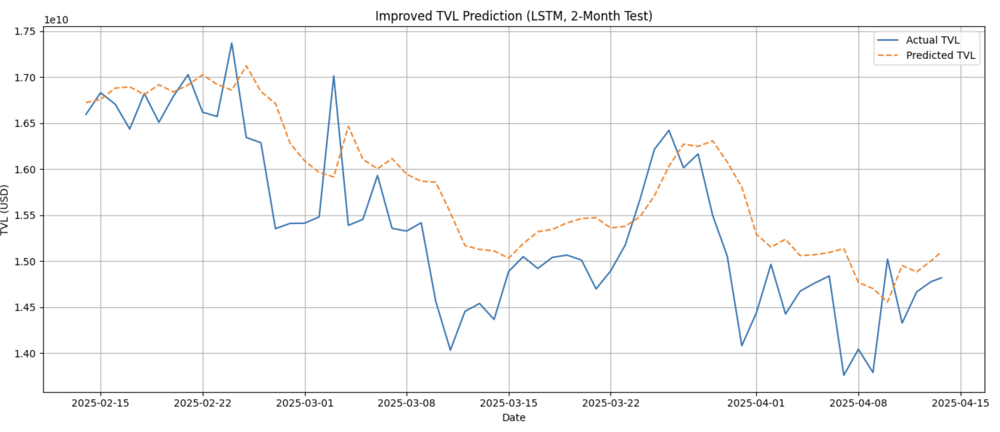

This project uses an LSTM neural network to forecast the Total Value Locked (TVL) in Aave, a major DeFi protocol on Ethereum. By learning from historical TVL trends, the model makes forward-looking predictions that closely follow real-world movements. The notebook walks through the entire process—from data cleaning and scaling to training and evaluating the model. The final chart (shown below) compares actual vs. predicted TVL over a two-month test period, and clearly shows how well the model captures market patterns. It’s a strong demonstration of deep learning applied to DeFi analytics.

